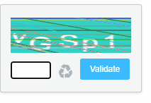
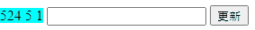
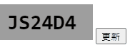

# Captcha驗證碼


前陣子要做登入驗證碼。    
<!--more-->

為求快速，直接找有提供範例的。  

一開始找到個高手自己寫出JavaScript的函式，  
是很漂亮，但覺得有時不夠清楚，且怕有版權疑慮。  
[](3rd_party.gif)  

之後找到一個較簡易版本的，易懂但略嫌寒酸。  
[](javascript.gif)  

最後得知HTML5有個Canvas，可以寫出簡單大方的認證碼。  
[](canvas.gif)  

```HTML
<!DOCTYPE html>
<html lang="en">

<head>
    <meta charset="UTF-8">
    <title>Title</title>
    <style>
        canvas {
            border: 1px black solid;
            padding: 20px;
        }

        #textCanvas {
            display: none;
        }
    </style>
    <script type="text/javascript" src="jquery-3.6.0.min.js"></script>
</head>

<body>
    <canvas id='textCanvas' height=50 width=130></canvas>
    
    <button onclick="GenerateCaptcha()">更新</button>
    <br />
    <br />
</body>

<script>
    $(document).ready(function () {
        GenerateCaptcha();
    });

    $(document).ready(function () {
        GenerateCaptcha();
    });
    var _canvas = document.getElementById('textCanvas');
    var tCtx = document.getElementById('textCanvas').getContext('2d'),
        imageElem = document.getElementById('image');
    function randomString(length, chars) {
        var result = '';
        for (var i = length; i > 0; i--) result += chars[Math.floor(Math.random() * chars.length)];
        return result;
    }
    function GenerateCaptcha() {
        var rString = randomString(6, '0123456789ABCDEFGHIJKLMNOPQRSTUVWXYZ');
        var newElem = rString;
        tCtx.fillStyle = "#9d9d9d"  //background color
        tCtx.fillRect(0, 0, _canvas.width, _canvas.height);
        tCtx.font = 'bold 22pt consolas';
        tCtx.fillStyle = "Black"  //font color
        tCtx.fillText(newElem, 10, 35);

        imageElem.src = tCtx.canvas.toDataURL();
        console.log(rString);
        console.log(imageElem.src);
    }

</script>

</html>
```
