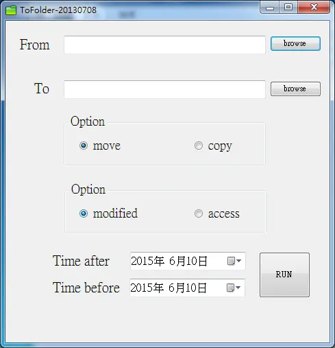
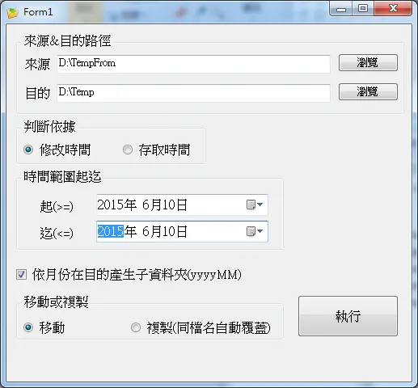

# 指定目錄搬移大量檔案

維護的系統有提供上傳附件的功能。  
也不意外，這功能是一般系統都會有的功能。  
<!--more-->

大概是開發者沒想過這系統會用那麼久，  
上傳的目錄並無額外子目錄，就把所有檔案像大雜燴一樣統統塞一起。  

因塞久了硬碟會滿，就得把較舊的檔案搬移。  

但一進入資料夾因為檔案太多就快死機了；  
為了要備份較舊檔案，檔案開啟後以時間排序又要死一次。  

系統的上傳程式我改不了，那我讓備份這邊的輕鬆點，就生出了[這程式](https://github.com/github-lym/CopyToFolder)。  

可以指定路徑並依檔案時間判斷移到另一指定路徑，  
不再開啟資料夾浪費時間。

\
\
\
下方圖片為後來進階版。  
全部重寫後效能應有增加，並且增加了依月份產生資料夾功能。  
還很騷包附上了進度條(ProgressBar)。
  
\
\
\
當然啦，現在有**robocopy**應該就比較方便了。  
\
\
結果20220928手癢又改了一版本。  
另附上傳輸中檔案已傳輸容量進度條。  
  

