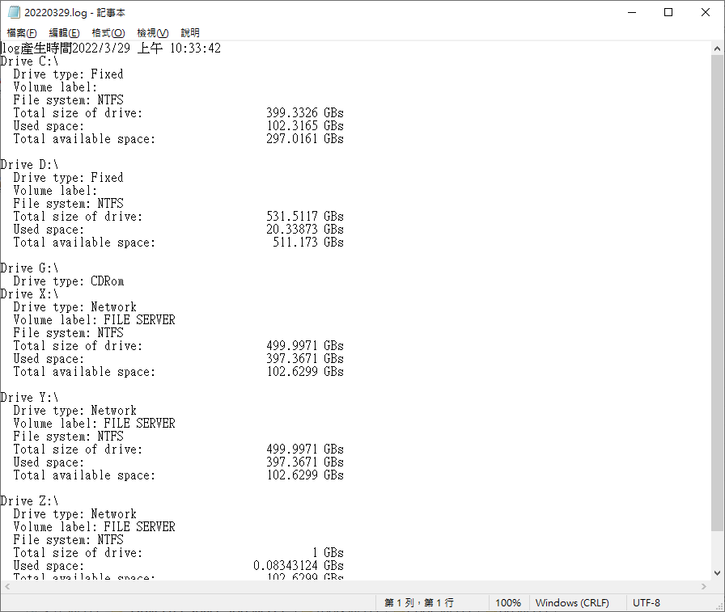

# 查詢磁碟容量


因代理同事工作，才知道他每天得特地進機房看某主機的硬碟剩餘空間。  
<!--more-->

沒辦法，一樣沒有遠端連線可直接登入觀看。  
可以秀出磁碟空間的寫法，MSDN就有資料所以直接照抄。  
好在FTP沒被擋，用[程式](https://github.com/github-lym/DriveFreeSpace)排程產生log，再用FTP連到該主機看。  
[](screenshot.png)  

> 取得磁碟資料
>
> ```csharp
> DriveInfo[] allDrives = DriveInfo.GetDrives();
> ```
>
> 列出
>
> ```csharp
> foreach (DriveInfo d in allDrives)
> {
> 	if (!File.Exists(logFullPath))
> 		log = new StreamWriter(logFullPath);
> 	else
> 		log = File.AppendText(logFullPath);
> 
> 	log.WriteLine("Drive {0}", d.Name);
> 	log.WriteLine("  Drive type: {0}", d.DriveType);
> 
> 	if (d.IsReady == true)
> 	{
> 		log.WriteLine("  Volume label: {0}", d.VolumeLabel);
> 		log.WriteLine("  File system: {0}", d.DriveFormat);
> 
> 		gb = (float)(d.TotalSize / 1073741824d);
> 		log.WriteLine(
> 			"  Total size of drive:            {0, 15} GBs",
> 			gb);
> 		gb = (float)((d.TotalSize - d.AvailableFreeSpace) / 1073741824d);
> 
> 		log.WriteLine(
> 			"  Used space:                     {0, 15} GBs",
> 			gb);
> 
> 		gb = (float)(d.TotalFreeSpace / 1073741824d);
> 		log.WriteLine(
> 			"  Total available space:          {0, 15} GBs",
> 			gb);
> 		log.WriteLine("");
> 	}
> ```
>
> 
