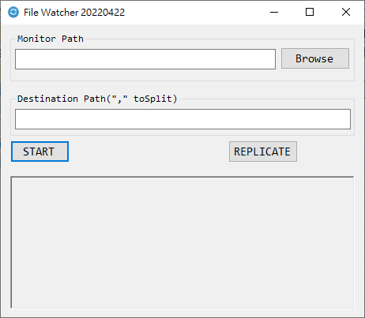

# FileWatcher

將檔案備份至多個硬碟對我來說一直是個很花時間的事。

<!--more-->

主要是目前的同步備份是還是不夠聰明。

假設已有個備份為 A 檔案，如果 A 要更名為 A'，  
那一般的同步軟體就是把已備份的 A 刪除，  
然後將 A'(內容還是 A)視為新檔案複製一份。  
檔案如果很大就很花時間，明明只是改了檔名而已。  
移動也是一樣的情況，就是改個路徑而已。  

所以我寫了[FileWatcher](https://github.com/github-lym/FILEWATCHER)處理這問題。  
  
其實就是用到`FileSystemWatcher`來監視幹了什麼，  
整理一下把同樣的動作弄到其他備份區域。  

我的能力是沒有寫到即時同步啦，就還是得按個鍵重現這些異動。  
不同於一般同步軟體就是可以偵測目標資料夾的檔案名稱與路徑異動。  

