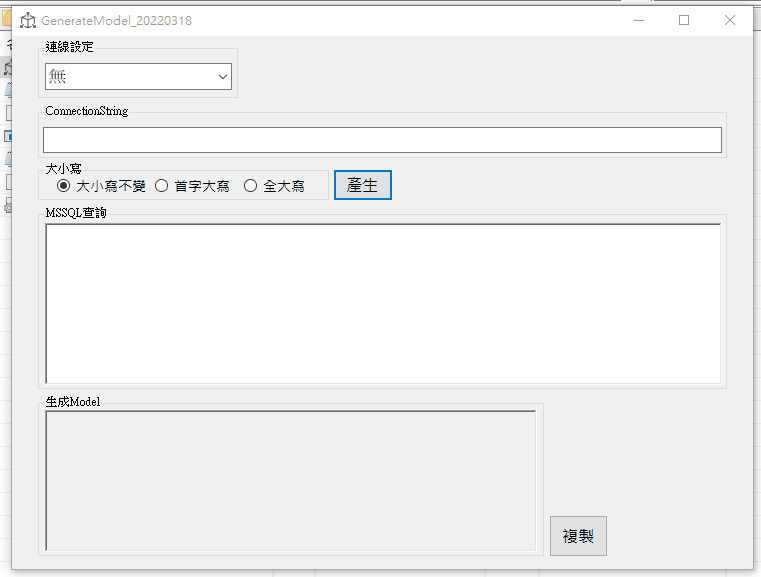

# GenerateModel—Model生成工具

結束駐點回公司後開始寫MVC。  

<!--more-->

用的是Entity Framework，開發時會產生很多Model。  

**每次都依SQL指令乖乖刻出Model還得注意型別實在不是我的個性。**  

好在網路上已有別人寫好的Method，直接拿來參考就[做出來了](https://github.com/github-lym/GenerateModel)。  

有了這個就方便很多。  
  
偶然在開發討論區看到有人也有這問題，發現有相同困擾的人並不少。  
大部份也是做個類似程式處理。  
  
  
後來又改成可以依INI檔切換資料庫。  
  

