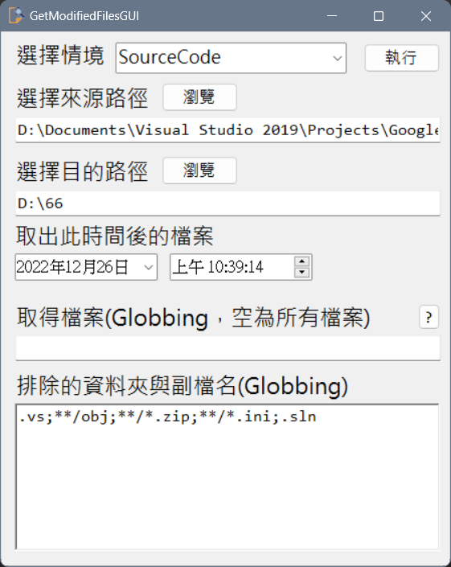

# GetModifiedFiles—匯出更新的資料

寫完的程式要做源碼掃描。  

<!--more-->

作業方式是只取出有異動過的檔案，還要照原始目錄路徑放置。 
  
覺得取出很浪費時間又容易出錯的我寫了[這個](https://github.com/github-lym/GetModifiedFiles)。   
讀取INI檔的`來源跟目的資料夾`，  
可以設定`排除的資料夾與副檔名`，  
和`檔案存取的時間`(會匯出在這時間之後異動的檔案)。  
  
之後發現類似的情境很多，所以改成[GUI版](https://github.com/github-lym/GetModifiedFilesGUI)。  
可以設定好不同參數切換使用，方便不少。  
  
  
20221226更新  
感謝[黑暗執行緒大大](https://blog.darkthread.net/blog/file-globbing/)讓我得知Globbing的用法，小改了一下程式。  
|  比對樣式	|符合對象|
|  ----  | ----  |
|\*.txt	|所有 .txt 副檔名|
|\*.\*	|所有有附檔案名的檔案|
|\*	|最上層目錄的所有檔案|
|.\*	|以 '.' 起始的檔案|
|\*word\*	|檔案包含 'word'|
|readme.\*	|主檔名 'readme'，附檔名不限|
|styles/\*.css	|目錄 'styles/' 下的所有 .css 檔|
|scripts/\*/*	|'scripts/' 及第一層子目錄下所有檔案|
|images\*/\*	|以 'images' 起始目錄下的所有檔案|
|\*\*/*	|所有子目錄的所有檔案|
|dir/\*\*/\*	|'dir/'下所有子目錄的所有檔案| 

 

