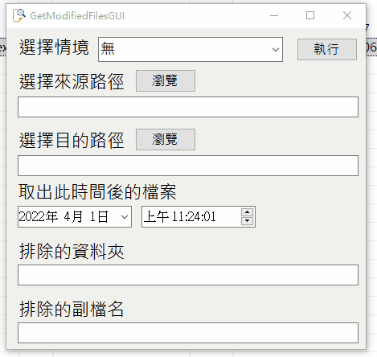

# GetModifiedFiles—匯出更新的資料

寫完的程式要做源碼掃描。  

<!--more-->

作業方式是只取出有異動過的檔案，還要照原始目錄路徑放置。 
  
覺得取出很浪費時間又容易出錯的我寫了[這個](https://github.com/github-lym/GetModifiedFiles)。   
讀取INI檔的`來源跟目的資料夾`，  
可以設定`排除的資料夾與副檔名`，  
和`檔案存取的時間`(會匯出在這時間之後異動的檔案)。  
  
之後發現類似的情境很多，所以改成[GUI版](https://github.com/github-lym/GetModifiedFilesGUI)。  
可以設定好不同參數切換使用，方便不少。  
  

