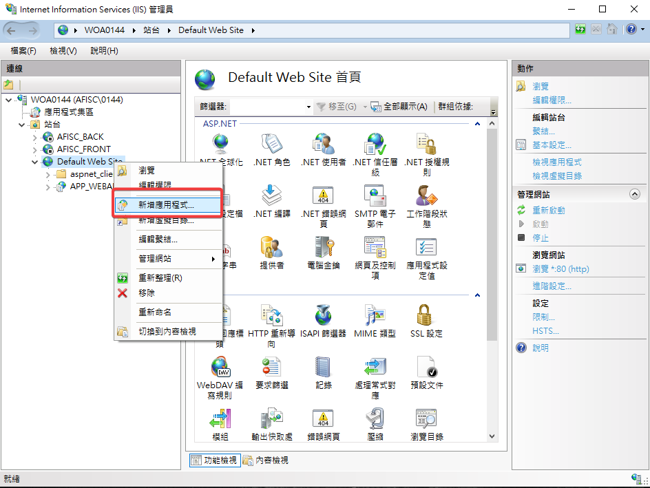
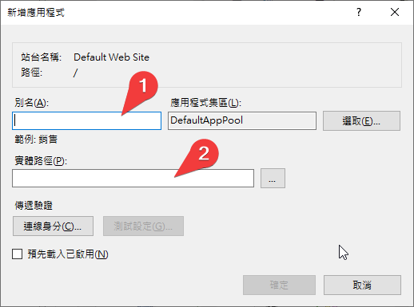
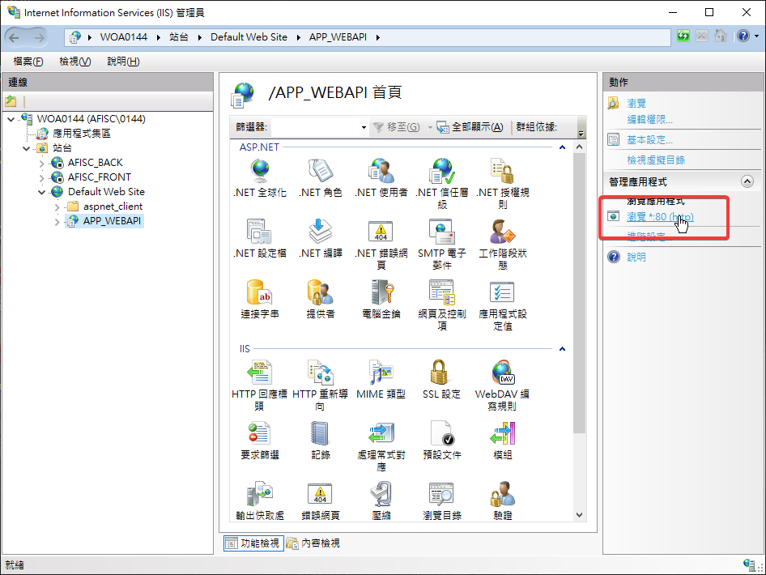
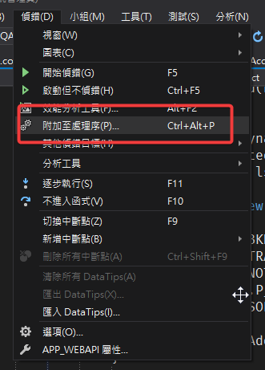
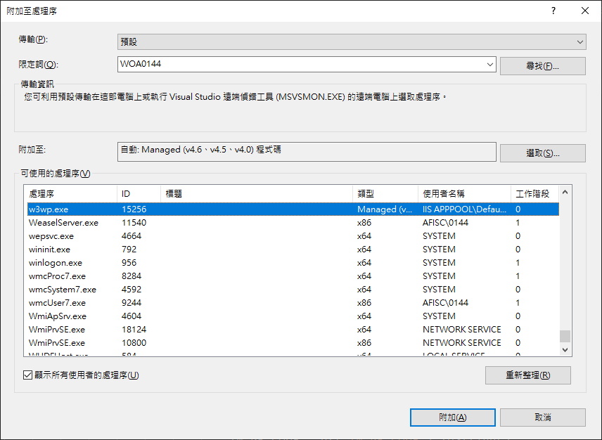

# 使用IIS搭配Visual Studio除錯

通常只用visual studio內建的IISExpress除錯。
<!--more-->
  
1.  選擇`新增應用程式`
  
 
  
2.  `實體路徑`就選該專案的路徑
  
 
  
3.  起碼得預覽一次(才會產生`w3wp.exe`執行緒)
  
 
  
4.  記得以`以系統管理員身分執行`啟動visual studio  
至選單點選`附加至處理序`(位置依版本會有差異)
  
 
  
5.  選擇`w3wp.exe`執行緒
  
 
  
