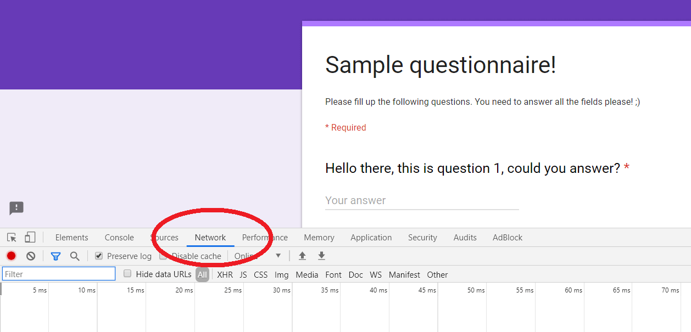
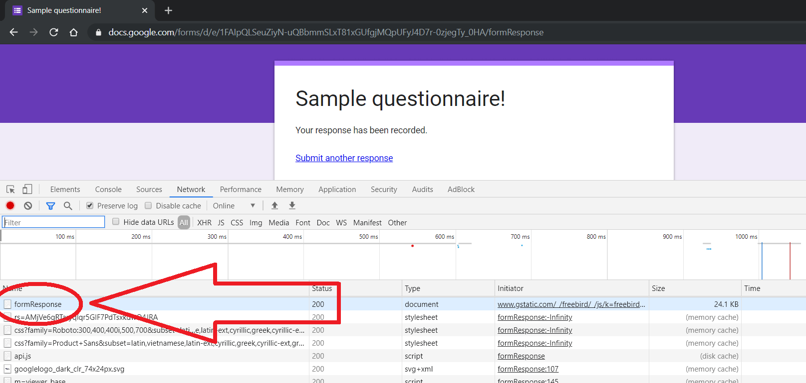
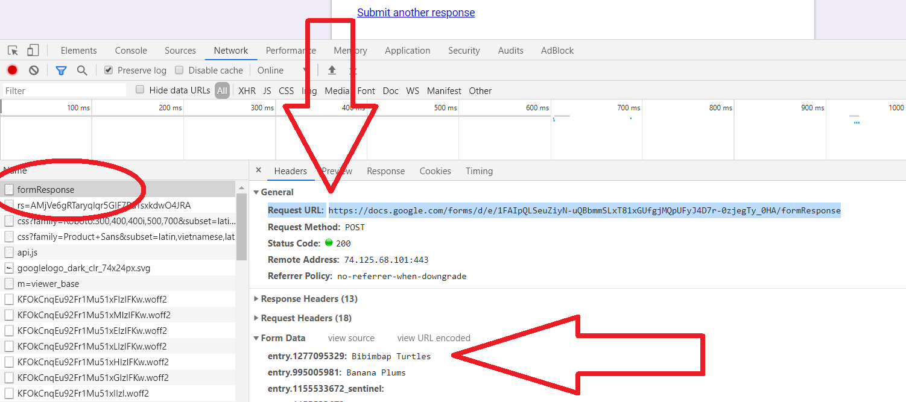
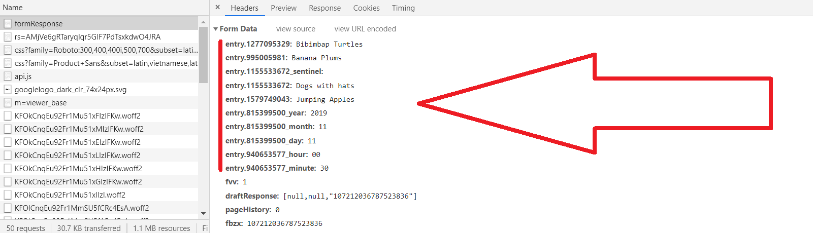
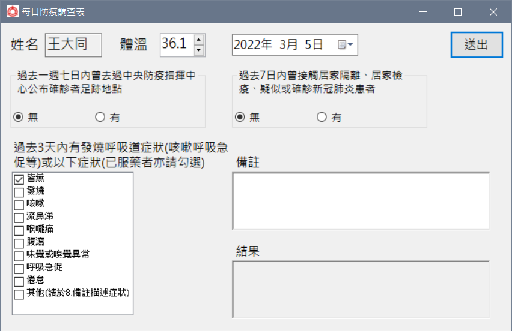

# 送交Google表單

疫情的關係，公司設計了一個Google表單要我們每日填寫。  

<!--more-->

令人不懂的是，在感受異常那欄不准勾選任何狀況。  

**每日調查不就是為了掌握？卻不准勾選自認異常的部份。**  

天天都要填寫，只能填體溫卻要打一堆字，我懶人病又發了。  
就研究一下Google表單怎麼傳送的。  

在Chrome`開發者者工具(F12)`可以看到表單欄位的代號。  
  
  
  
  
  
  
加上也有範例可參考，很快就[做出來](https://github.com/github-lym/Submit_GoogleForm)了。  
  
  
**不過程式做完不到一個月就提離職又是另一個故事了。**
