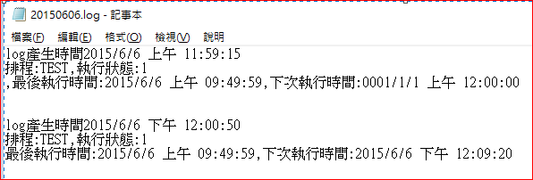

# 查詢排程狀態


因代理同事工作，才知道他每天需記錄排程是否順利。  
<!--more-->

要特地進機房看某主機排程是否有順利進行。  
因資安問題並沒有開放遠端連線，所以只能用這種沒效率的方法。  
\
我就找資料寫了這[程式](https://github.com/github-lym/TaskScheduler)。  
可以指定排程名稱產生log。  
再用FTP連到該主機看該log(好在FTP沒被禁)，省去進機房的麻煩。  
[](screenshot.png)  

>取得排程資料
>```csharp
>TaskService taskService = new TaskService();
>TaskCollection taskCollection = taskService.GetFolder(@"\").GetTasks();
>```
>
>```csharp
>log.WriteLine("排程:{0},執行狀態:{1}", taskCollection[j].Name, taskCollection[j].LastTaskResult);
>log.WriteLine("最後執行時間:{0},下次執行時間:{1}", taskCollection[j].LastRunTime, taskCollection[j].NextRunTime.ToString());
>```
>
>

