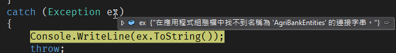
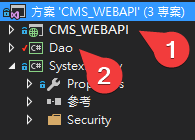
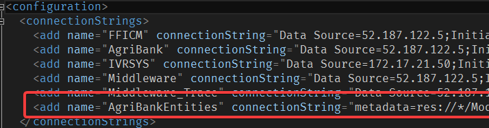
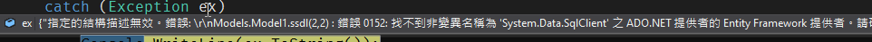
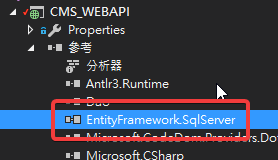

# 導入EntityFramework的嘗試與錯誤

想將工作上的傳統作法改用EntityFramework，就做了一下嘗試。  
<!--more-->

查了一下資料，在這種**非core架構**下，  
**DB First**還是無法避免使用edmx檔，就算了吧。  
\
本想說經歷過大風大浪(自己說)的我，這只不過是塊小蛋糕。  
結果一下就被結果打臉。   
\
\
先是說***在應用程式組態檔中找不到名稱為 'AgriBankEntities' 的連接字串***。  
  
\
\
經查結果發現因專案架構是長這樣。  
  
\
\
我導入EF是在***2***，由***1***呼叫，所以在***1***的**web.config**內，  
也要補上***2***的EF連線字串。  
  
\
\
一個心滿意足執行後，還是有錯誤！  
>指定的結構描述無效。錯誤: 
>Models.Model1.ssdl(2,2) : 錯誤 0152: 
>找不到非變異名稱為 'System.Data.SqlClient' 之 ADO.NET提供者的 Entity Framework 提供者。
>請確定提供者已在應用程式組態檔的 'entityFramework' 區段>中註冊。
>如需詳細資訊，請參閱 http://go.microsoft.com/fwlink/?LinkId=260882。  

  
\
\
再查才知道呼叫的那個專案也得引入參考！  
  
\
\
有試有收穫，有空再來試試`Dapper`。
