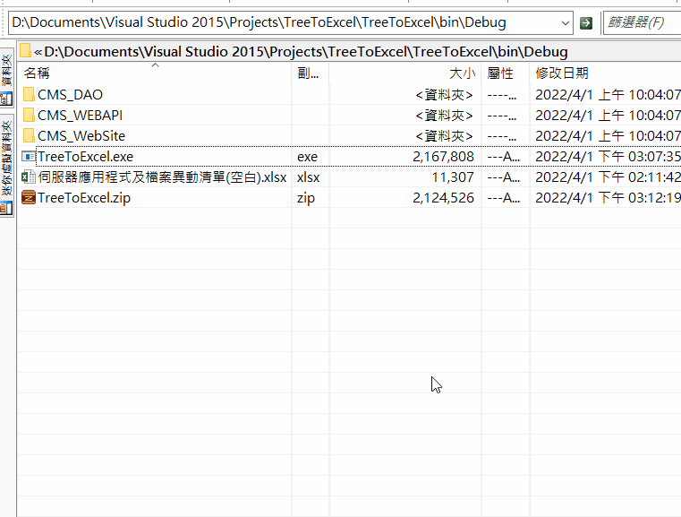

# TreeToExcel—列出子資料夾檔案至Excel

版更要寫一份Excel—伺服器應用程式及檔案異動清單。  

<!--more-->

列出有異動過的檔案，也需列出目錄路徑。 

犯懶的我寫了[這個](https://github.com/github-lym/TreeToExcel)。   
跟空白Excel直接放在資料夾執行就好。  

這是我第一次用`Interop.Excel`寫(之前大多用`NPOI`)。  
會想用Interop.Excel寫是當下覺得公司同仁都有裝Office，  
就想讓程式直接調用就好，也省得用第三方套件建置出一堆dll。  

寫出來是寫出來了，但執行速度不甚滿意。  

*上網尋找同溫層發現不只我一人。*

就再使用別人推薦的`ClosedXML`，
**果然速度大幅躍進！**

  
  
  
### 反倒是後面想建置出來的dll包執行檔裡面花了比較多時間。

