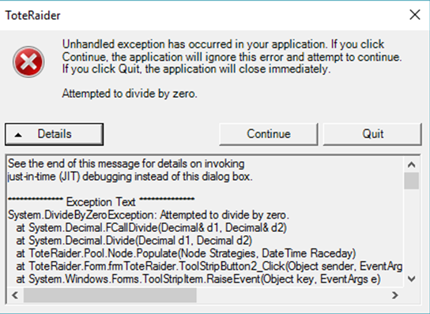
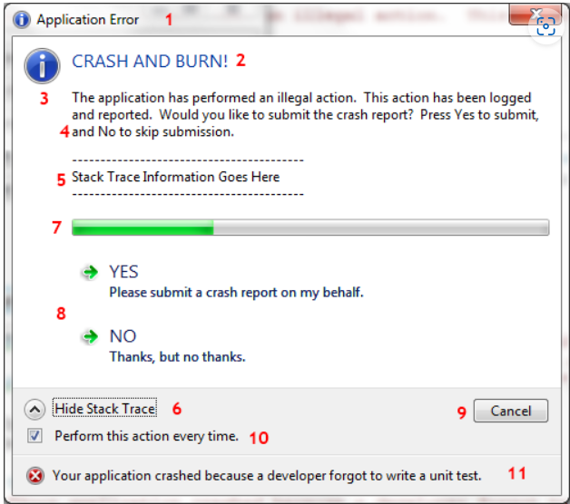
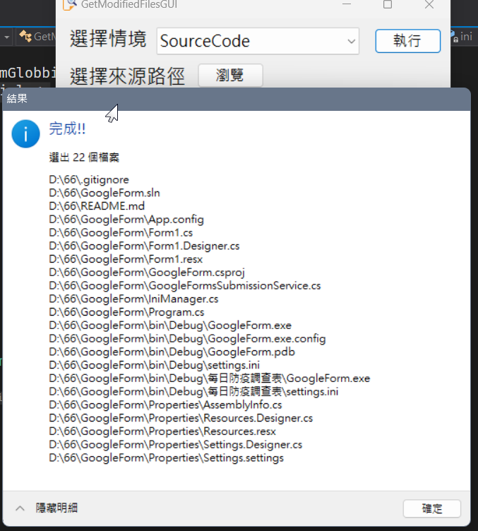

# Microsoft.WindowsAPICodePack.Dialogs

想在固有的程式跳出顯示明細，但又覺得MessageBox太陽春。    
<!--more-->
一開始上網找了一方法，是調用Windows內建的錯誤視窗。  
但覺得又沒錯誤，幹嘛有個叉叉在那邊？  
而且還有取消按鈕找不到方法消掉。  
   
  
\
上網找了才知道有`Microsoft.WindowsAPICodePack`這東西。  
雖是微軟的，但沒隨VisualStudio附上，得自行下載安裝。  
其中一個`Microsoft.WindowsAPICodePack.Dialogs`可以達到我的要求。  
\
上網看到這[範例](https://www.developerfusion.com/article/71793/windows-7-task-dialogs/)挺強大的。  
  
1. Title bar
2. Instruction Text
3. Icon
4. Text
5. Collapsed Text
6. Collapse Toggle
7. Progress Bar
8. Controls
9. Standard Buttons
10. Footer Checkbox
11. Footer Text  
  
\
自己稍微東施效顰一下，算可以接受吧？  
 
