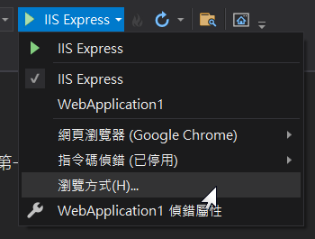
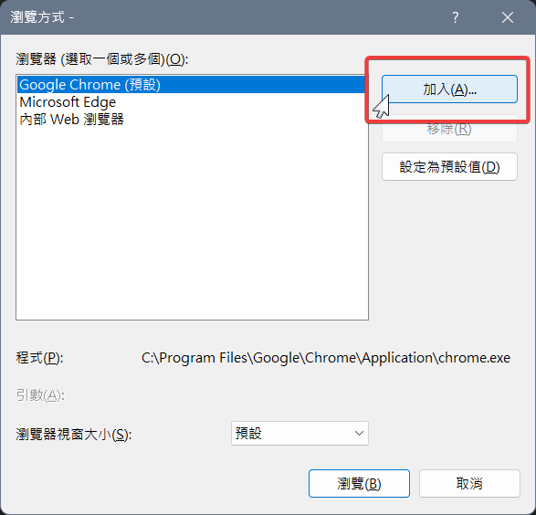
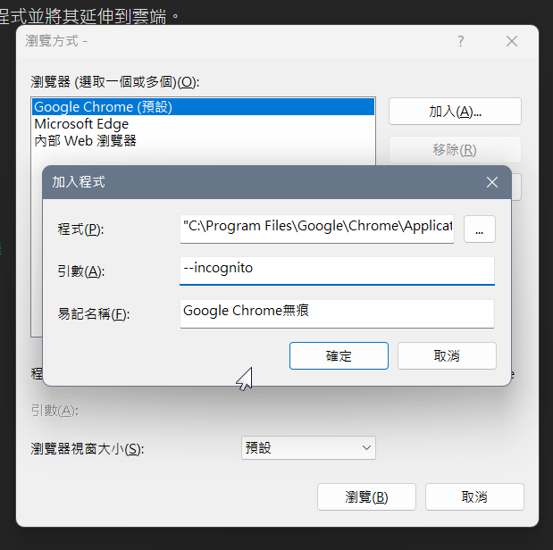
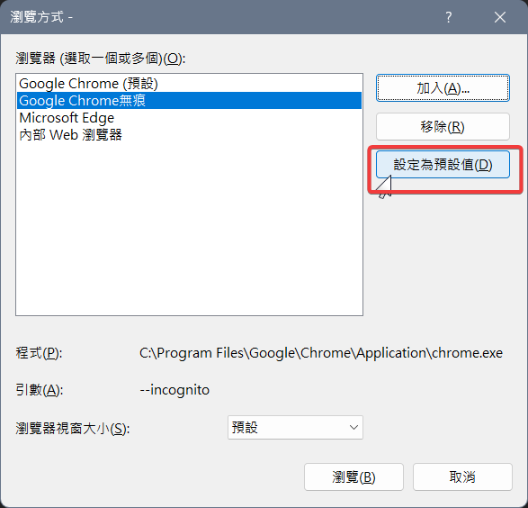
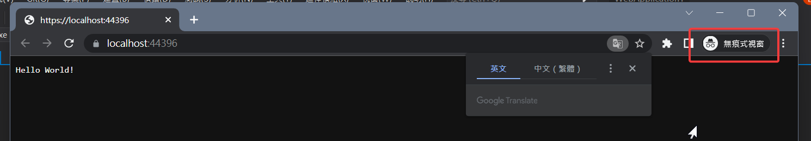

# 用無痕模式開啟瀏覽器除錯

沒想到早就可以這麼做！
<!--more-->
若不是用無痕模式，偶爾會有畫面還是舊的情況。  
我都還會特地把Visual Studio本來呼叫的視窗關掉，自己再開個無痕。  
#### *是也可以啦，但就有些麻煩。*    
  
前幾日稍稍找了一下，發現早就可以設定了。  
  
先選擇`瀏覽方式`。  
 
  
選`加入`。  
 
  
跟建立無痕桌面捷徑一樣的方式。  
   
  
建完改為預設值。  
  
  
順利成功執行！  

